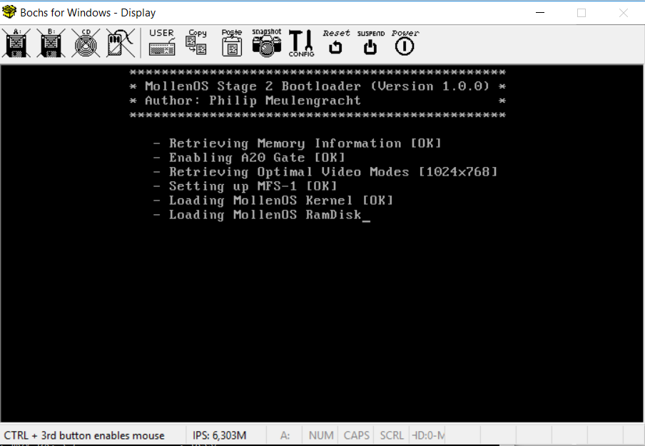
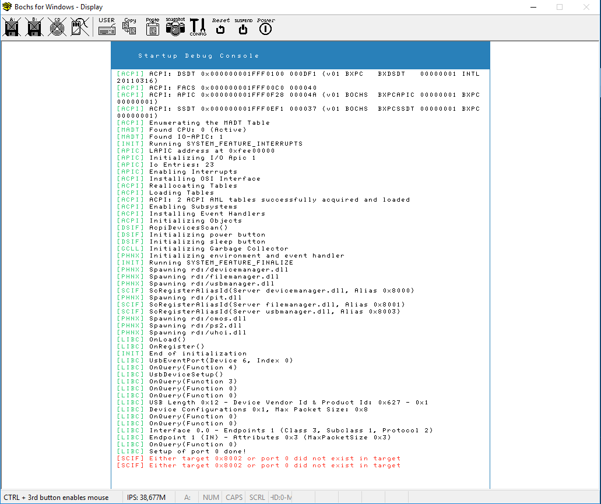
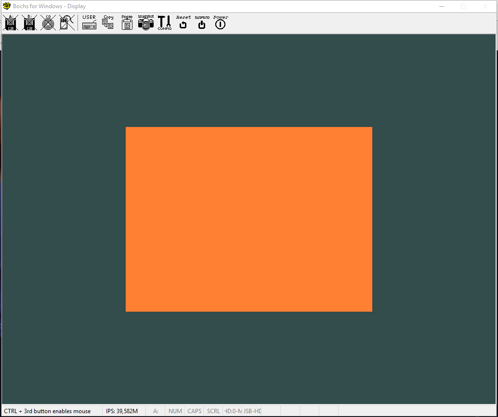

# About MollenOS

[/statusIcon)](http://ec2-35-157-236-132.eu-central-1.compute.amazonaws.com/project.html?projectId=ValiOS&branch_ValiOS=__all_branches__)
[/statusIcon)](http://ec2-35-157-236-132.eu-central-1.compute.amazonaws.com/project.html?projectId=ValiOS&branch_ValiOS=__all_branches__)

## The Goal

The goal with MollenOS is to provide users with a free, modern operating system, capable of running on as many platforms as possible. Initially the goal will be to support the most popular platforms (Arm and x86). The focus will be in the user-experience as soon as I get that far with MollenOS.

## How it started

MollenOS is a OS project that started back in 2011 as a hobby project. I then took a long break and picked up development again in the start of 2015 by rewriting the entire OS structure as it became apparant to me the initial design was really bad and not scalable nor modular enough to support multiple platforms. The project has then been in development from 2015, to the current date (as of writing this).

## Current Progress

Progress so far is that the kernel has succesfully been converted to a hybrid micro-kernel. Drivers have all been fitted to the new driver framework and
are compiling. The new toolchain has also been taken into use (llvm/clang/lld) and i am currently working on a native port of said toolchain. The focus
for 2018 will be the userspace, and stability/robustness of the operating system. No new features are planned for the OS, and no new drivers unless
I should reach a point where they are highly required.

Userspace libraries that are being ported currently (native builds)
 - None at the moment, currently working on the window manager system

Userspace libraries planned for port in 2018
 - clang
 - tbd (rest will be announced as we go)

## Project Structure

- /boot (Contains bootloaders and anything boot-related)
- /docs (Contains documentation about the project and the OS)
- /install (Contains the deploy folder for installing the OS)
- /kernel (Contains the MollenOS kernel source code)
- /librt (Contains all support and runtime libraries needed for MollenOS)
- /modules (Contains drivers for MollenOS)
- /servers (Contains system services like the filemanager for MollenOS)
- /tools (Contains tools for building and manipulating)
- /userspace (Contains software projects for the user-applications)

## Core-Features

### Boot
MollenOS uses it's own filesystem (MFS), it is not booted by the more traditional way of GRUB. Instead it has it's own advanced bootloader, which can be found in the /boot directory. mBoot is written specifically for MollenOS, and supports booting from both FAT32 & MFS.

### Kernel
MollenOS supports a wide array of features and has implementation for VFS, Processes, Pipes, an advanced PE loader (which is used as the file format in MollenOS), ACPICA built in and MollenOS natively uses UTF-8 in it's kernel. UTF-8 Is implemented in a library called MString which is written for MollenOS.

### MollenOS FileSystem (MFS)

ToDo

### MString Library

ToDo

## Drivers:
    - AHCI
    - ACPICA
    - MFS
    - HPET
    - USB Stack (OHCI, UHCI, EHCI)
    - USB MSD
    - USB HID
    - (x86) PCI/PCIe
    - (x86) CMOS
    - (x86) PIT
    - (x86) RTC
    - (x86) PS2 Mouse & Keyboard
    - (x86) APIC

## Documentation

All documentation about design and implementation, and the theory behind is stored in the `/docs` folder. Right now there isn't any documentation, but it'll all come with the Documentation milestone.

## Screenshots

Showcase of MollenOS to get an idea of how the userspace will be once it's finished.

### Boot Screen

### Usage

ToDo

## Implementations & Essential Software

### The C-Library, C++ Library and OS Library

The run-time libraries used/implemented in mollenos are:
 - libcrt (Contains compiler support functions and entry points for apps/drivers/etc)
 - libclang (Contains compiler support for clang)
 - libc + libm (Contains the standard c library support for the c-language)
 - libcxx (Contains the standard c++ library runtime and support for the c++-language)

The c++ runtime and support is a native port of the c++ runtime for clang and the itanium abi. All os support functions are available in
the standard c library.

### Vioarr (Window Manager)

Vioarr (formerly known as Sapphire), is the windowmanager for MollenOS. It will be based upon a 3d platform (opengl) to perform advanced and beautiful
graphical user interfaces.

### Ported libraries and programs

These are the various libraries ported to MollenOS userspace, and are primarily used by system software, like the terminal, window manager etc.

| Library       | Version   | Description             |
| ------------- | ---------:|:-----------------------:|
| openlibm      | <unk>     | open mathematical c-library   |
| compiler-rt   | <unk>     | llvm/clang compiler runtime support  |
| libunwind     | <unk>     | unwind support for the c++ itanium abi  |
| libcxxabi     | <unk>     | c++ itanium abi compiler support implementation  |
| libcxx        | <unk>     | c++ standard library support   |
| llvm          | <unk>     | The LLVM compiler back-end   |
| mesa3d        | <unk>     | Open source 3d opengl framework   |
| zlib          | <unk>     | Compression library   |
| libpng        | <unk>     | PNG image library   |
| freetype2     | <unk>     | Library to handle and render fonts   |

## Building MollenOS

### Pre-requisites

In order to build MollenOS you will need the following libraries and programs:
 - Clang cross-compiler
 - Nasm
 - Monodevelop
 - Git
 - Cmake (3.8+)

### Build Script Information
The build and install process is almost fully automated on windows, and is controlled by makefiles, the only thing you have to run is the <make>. In order to customize your installation and build process, there is a number of definitions that can be turned on and off in the makefile.
