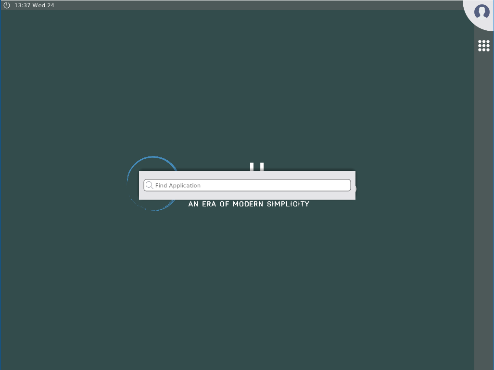
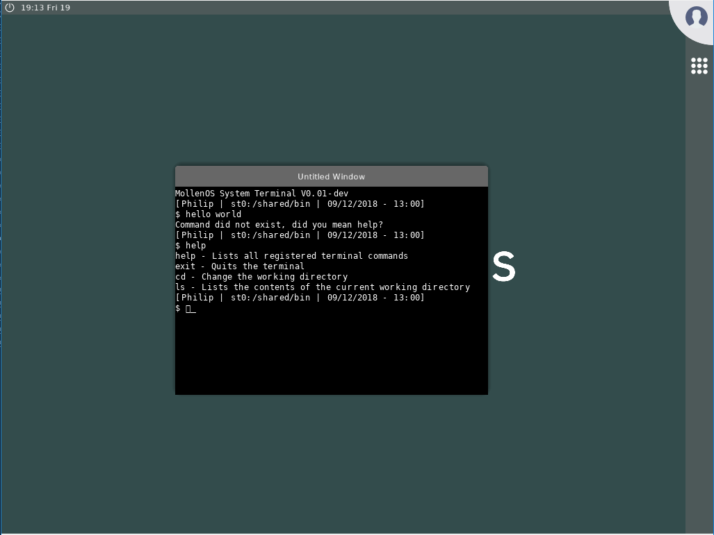

# The Mollen(/Vali) Operating System 

| Build Configuration   | Status   |
| --------------------- |:-------- |
| I386                  |  |
| AMD64                 |  |

## Table of Contents

1. [Getting started](#getting-started)
    1. [Environmental variables](#env-variables)
    2. [Setting up the toolchain](#setting-up-toolchain)
    3. [Setting up for OS development](#setting-up-devenv)
    4. [Setting up for application development](#setting-up-app-devenv)
    5. [The build options for cmake](#build-options)
    6. [The build commands](#build-commands)
    7. [Known issues](#known-issues)
2. [Contributing](#contributing)
    1. [Submitting issues](#contrib-issues)
    2. [PRs](#contrib-pr)
3. [Roadmap](#roadmap)
4. [Features](#features)
    1. [Bootloader](#features-boot)
    2. [Kernel](#features-kernel)
    3. [Drivers](#features-drivers)
5. [Documentation](#documentation)
    1. [Project structure](#doc-project-structure)
6. [Screenshots](#screenshots)
    1. [Boot](#ss-boot)
    2. [Usage](#ss-usage)

## Getting started 

### Environment variables 
Before you setup anything you must setup environmental variables that are used by
the project.

| Variable              | Required | Description             |
| --------------------- |:-------- |:-----------------------:|
| CROSS                 | Yes      | Points to where the cross-compiler is installed. |
| VALI_APPLICATION_PATH | No\*     | Points to where the Vali applications/libraries are built. |

\* Can be supplied to include built applications in the kernel image

### Setting up the toolchain 
The only thing you need to get started is a succesfully built toolchain of llvm/clang/lld. To help make this easier
I have made a fully automated script, which downloads all the neccessary components, and initiates a full build of llvm/lld/clang.
Make note that a full build of llvm/clang/lld need to run, and that this takes a couple of hours.

Toolchain scripts are located [here](https://github.com/Meulengracht/vali-toolchain). You should run the scripts in this order:
- depends.sh
- checkout.sh
- build-cross.sh

### Setting up for OS development 
The last step is now to run the depends.sh script that is located in this repository which installs
the final pre-requisites (nasm, mono-complete, cmake platform script). The script is located in tools/depends.sh.

After this, you are essentially ready to start developing on the operating system. When/if you make pull requests
when contributing, please follow the pull template that is provided.

### Setting up for application development 
If you want to build applications for Vali, you will need to install the sdk and ddk by using make install. This will install the required headers and libraries in a shared location that you specify during cmake configuration by using the CMAKE_INSTALL_PREFIX. 

Then follow the instructions located [here](https://github.com/Meulengracht/vali-userspace) to get the sources for the applications.

### The build option for cmake 
These are highlighted build configuration options for the cmake generation, there are more options, but these are the most often configured.

| Option            | Default Value | Description             |
| ----------------- |:-------------:|:-----------------------:|
| VALI_ARCH                 | i386  | Which architecture you will build the OS and applications for. Supported are i386 and amd64. |
| VALI_ENABLE_KERNEL_TRACE  | ON    | Enable debug tracing in the kernel. |
| VALI_ENABLE_SMP           | ON    | Enable multicore support in the kernel. |

### The build commands 
There is a series of build commands available.

| Command           | Description             |
| ----------------- |:-----------------------:|
| make              | Builds the operating system and support libraries |
| make install      | Installs the SDK and DDK to the location pointed by CMAKE_INSTALL_PREFIX. This is needed for app and driver development. |
| make install_img  | Creates a harddisk image with bootloader, kernel, libraries and built apps of format .img |
| make install_vmdk | Creates a harddisk image with bootloader, kernel, libraries and built apps of format .vmdk |

### Known issues 

#### Bochs
The uhci driver in bochs (2.6.9) defers packages when communicating with MSD devices to fake a seek delay,
however this results in issues with reading from the harddisk, since bochs does not correctly store the number
of deferred packages. See this issue description [here](https://forum.osdev.org/viewtopic.php?f=1&t=32574&start=0).

## Contributing 

I appreciate any form for contribution you want to make to the project! The project is purely driven by passion, and I dedicate any and all available spare time to this project. But to take this project to the next level I need support! Contributions of any kind are deerly welcome, but should follow the below guidelines.

You can start contributing on any aspect of the operating system, and if you should ever be in doubt, feel free to send me an email at phailmollen@gmail.com.

### Submitting issues 

When submitting issues, please take care that the issue is not a dublicate of an already existing, open issue. Please follow the templates specified for issues. Issues can be either a bug report or a feature request. If you feel like the feedback/issue you have does not fall into either category, pick the one you feel it fits the most.

### Pull Requests 

If you want to contribute as a developer on the project please fork the repository, and contribute via pull requests. There is a pull request template you can use when creating a pull request. Please allow for a day or two for me to review the pull request before accepting, as I will take a look as quickly as possible and submit your pull request.

## Roadmap 

Progress so far is that the kernel has succesfully been converted to a hybrid micro-kernel. Drivers have all been fitted to the new driver framework and
are compiling. The new toolchain has also been taken into use (llvm/clang/lld) and i am currently working on a native port of said toolchain. The focus
for 2019 will be the userspace, and stability/robustness of the operating system. No new kernel features are planned for the OS at this moment,
and no new drivers unless I should reach a point where they are highly required.

## Features 

### Bootloader 
MollenOS uses it's own filesystem (MFS), it is not booted by the more traditional way of GRUB. Instead it has it's own advanced bootloader, which can be found in the /boot directory. mBoot is written specifically for MollenOS, and supports booting from both FAT32 & MFS.

### Kernel 
MollenOS supports a wide array of features and has implementation for VFS, Processes, Pipes, an advanced PE loader (which is used as the file format in MollenOS), ACPICA built in and MollenOS natively uses UTF-8 in it's kernel. UTF-8 Is implemented in a library called MString which is written for MollenOS.

## Drivers 
    - AHCI
    - ACPICA
    - MFS
    - HPET
    - USB Stack (OHCI, UHCI, EHCI)
    - USB MSD
    - USB HID
    - (x86) PCI/PCIe
    - (x86) CMOS
    - (x86) PIT
    - (x86) RTC
    - (x86) PS2 Mouse & Keyboard
    - (x86) APIC

## Documentation 

All documentation about design and implementation, and the theory behind is stored in the `/docs` folder. Right now there isn't any documentation, but it'll all come with the Documentation milestone.

### Project structure 

- /boot (Contains bootloaders and anything boot-related)
- /cmake (CMake configuration files required to build the OS with cmake)
- /config (Make configuration files required to build the OS with make)
- /docs (Documentation and related resources about the project and the OS)
- /kernel (Contains the MollenOS kernel source code)
- /librt (Contains all support and runtime libraries needed for MollenOS)
- /modules (Contains drivers for MollenOS)
- /releases (Full releases of the OS)
- /services (Contains system services like the filemanager for MollenOS)
- /resources (Contains the deploy folder for installing the OS)
- /tools (Contains tools for building and manipulating)

## Screenshots 

Showcase of MollenOS to get an idea of how the userspace will be once it's finished.

### Boot 

### Usage 

