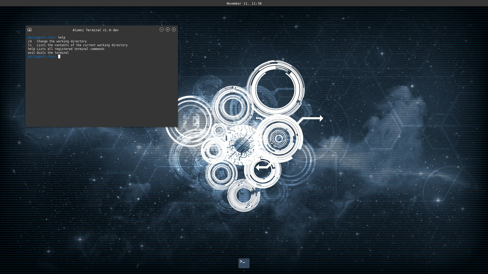

# The Mollen(/Vali) Operating System 

MollenOS/Vali is an **open-source operating system**. The operating system is build with focus
on modern principles. The inspiration for building this was originally to learn about operating
system concepts and to learn from the complexity involved. I found out that building MollenOS
was my passion, and I've been working on it since it was started in 2011. The primary goal of MollenOS
is to provide a modern user experience, both from a development perspective, but also from a user perspective.

One of the core features of MollenOS is being completely immutable. The core operating
system is packed into a read-only filesystem which gets mounted during boot. Applications are also packed into
read-only filesystem images which get mounted when installed. This ensures that both the operating system and its
software operate within as safe constraints as possible.

Discord - https://discord.gg/kgQ5uD2mH2

#### Current build status and nightly build download 

| Platform | Nightly Image (.img)                                                                   | Status                                                                                           |
|----------|----------------------------------------------------------------------------------------|:-------------------------------------------------------------------------------------------------|
| i386     | [Builds](https://github.com/Meulengracht/MollenOS/actions/workflows/nightly-build.yml) |    |
| amd64    | [Builds](https://github.com/Meulengracht/MollenOS/actions/workflows/nightly-build.yml) |  |

### Noteable projects

| Project  | Link                                                |                           Description                            |
|----------|:----------------------------------------------------|:----------------------------------------------------------------:|
| gracht   | [github](https://github.com/Meulengracht/libgracht) |       Protocol library heavily featured in MollenOS/Vali.        |
| vioarr   | [github](https://github.com/Meulengracht/vioarr)    | Window manager with terminal and launcher built ontop of Gracht. |
| openlibm | [github](https://github.com/JuliaMath/openlibm)     |                  Math library used in MollenOS                   |
| acpica   | [github](https://github.com/acpica/acpica)          |                     Open source ACPI library                     |

# Installing MollenOS

The recommended method for trying MollenOS is to download the nightly build above. This will provide you with
an .img file that you can boot in either qemu or bochs emulators. (Or other that accept .img files).

If you need the vmdk format for VMware or VirtualBox, then you will have to follow the build guidelines on how to
build the image for yourself.

MollenOS is not mature enought to be a daily driver, and thus no steps will be provided on how to install
the OS onto your local computer, as this would not be wise for either of us. If you want to do this you should
be tech-savvy enough to figure this out yourself.

# Building MollenOS

Build instructions are located here [BUILDING.md](BUILDING.md)

## Contributing 

I appreciate any form for contribution you want to make to the project! The project is purely driven by passion, and I dedicate any and all available spare time to this project. But to take this project to the next level I need support! Contributions of any kind are deerly welcome, but should follow the below guidelines.

You can start contributing on any aspect of the operating system, and if you should ever be in doubt, feel free to email me at phailmollen@gmail.com.

### Submitting issues 

When submitting issues, please take care that the issue is not a dublicate of an already existing, open issue. Please follow the templates specified for issues. Issues can be either a bug report or a feature request. If you feel like the feedback/issue you have does not fall into either category, pick the one you feel it fits the most.

### Pull Requests 

If you want to contribute as a developer on the project please fork the repository, and contribute via pull requests. There is a pull request template you can use when creating a pull request. Please allow for a day or two for me to review the pull request before accepting, as I will take a look as quickly as possible and submit your pull request.
